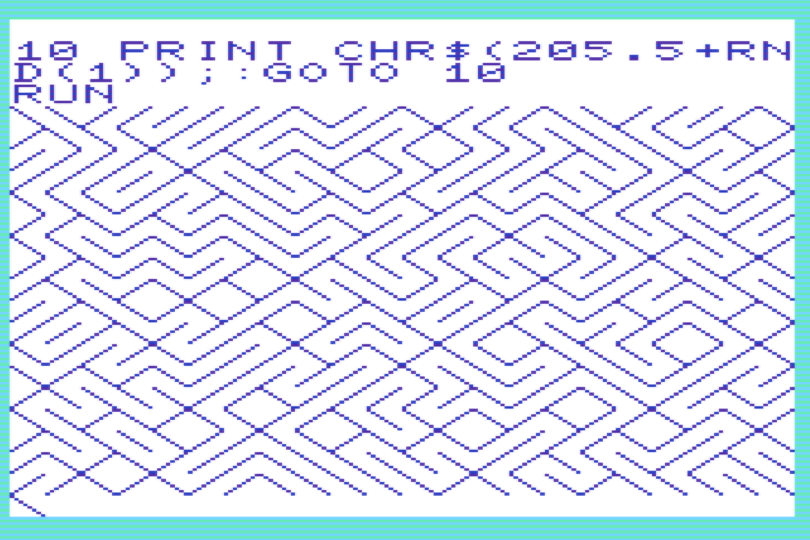
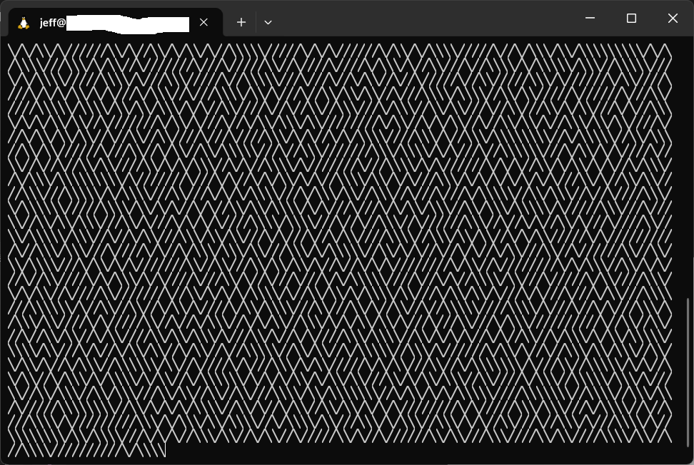

# asm-maze-generator
A program that mimics the famous one-liner Commodore BASIC command to display a random maze on a terminal.

 

Coded in Netwide Assembly (NASM, Linux 64-bit).

# Requirements
Any Linux 64-bit distribution with NASM and GCC. 

For Ubuntu/Debian distros:
```
sudo apt install nasm build-essential
```

# Build and run
```
git clone jeffgauthier/asm-maze-generator.git
cd asm-maze-generator
make
chmod u+x main
./main
```
